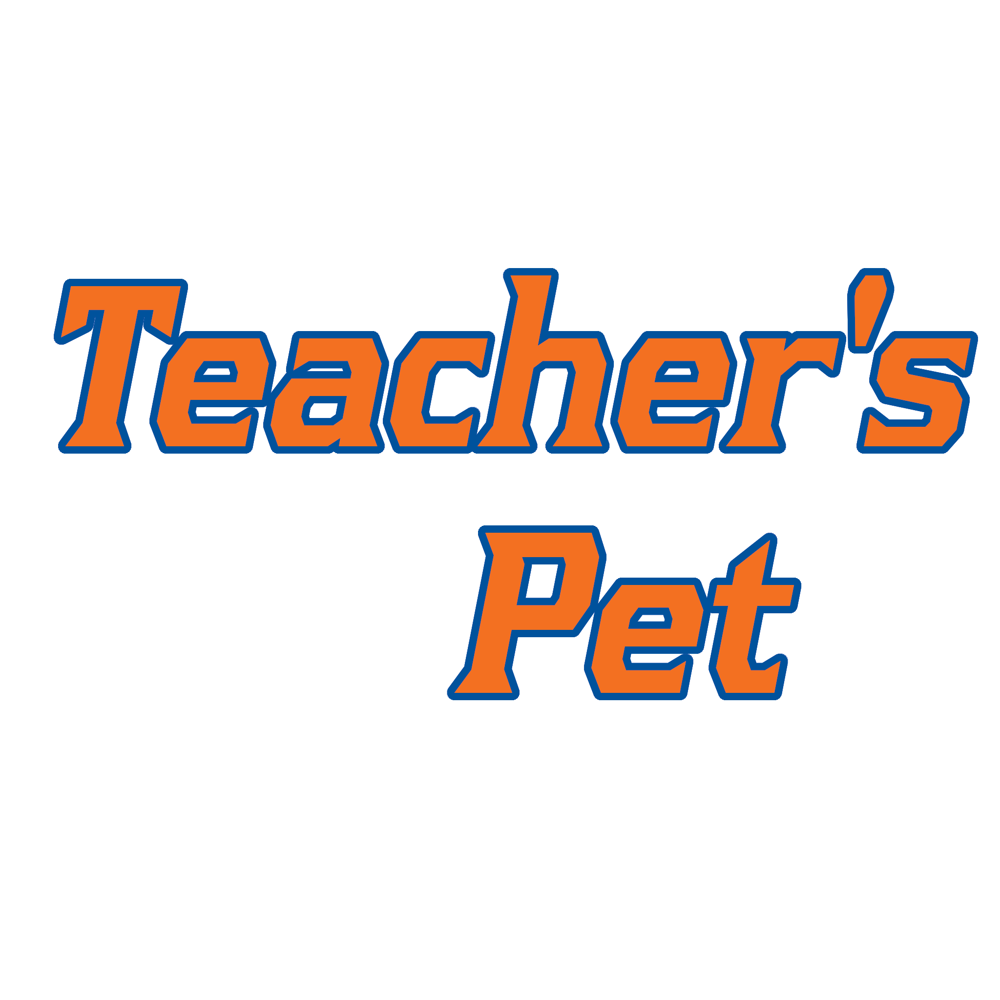

Senior Project

Teacher’s Pet is a companion app designed to assist computer science professors by simplifying their daily responsibilities, like grading, managing plagiarism, or running their students’ submissions for an assignment. 

Programmed for extensibility, professors can add their own modules to Teacher’s Pet to perform tasks specific to their course while keeping it organized cleanly within the application.

The project is designed in the .NET framework using WPF to run as a Windows Desktop application, using C# in the backend services and XAML as a frontend. 
